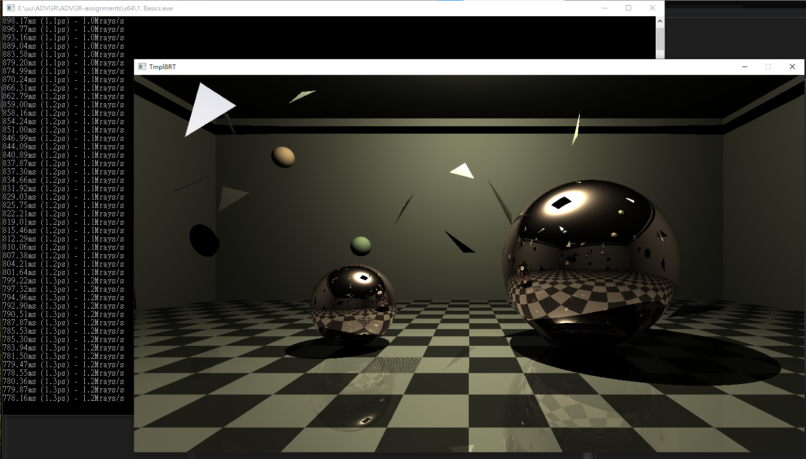
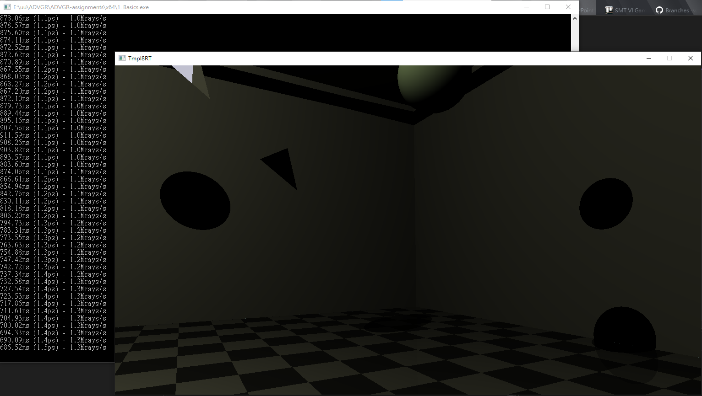
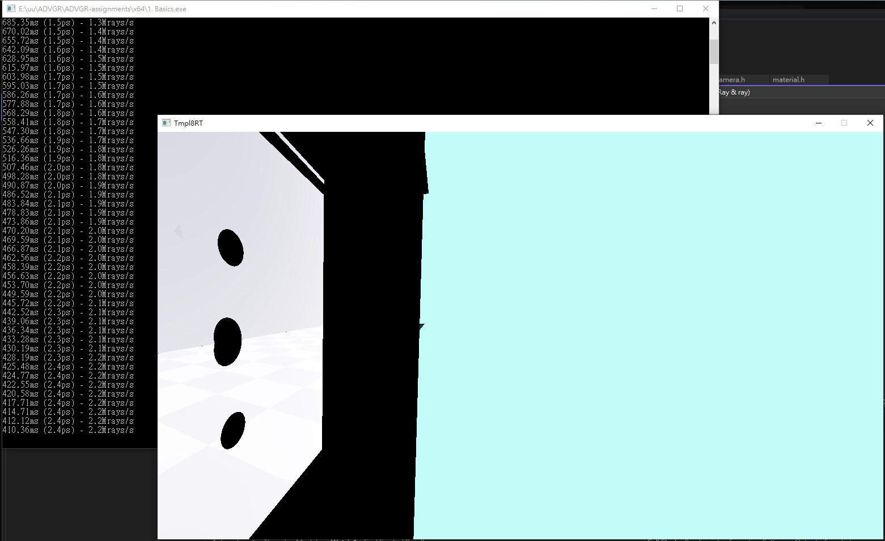
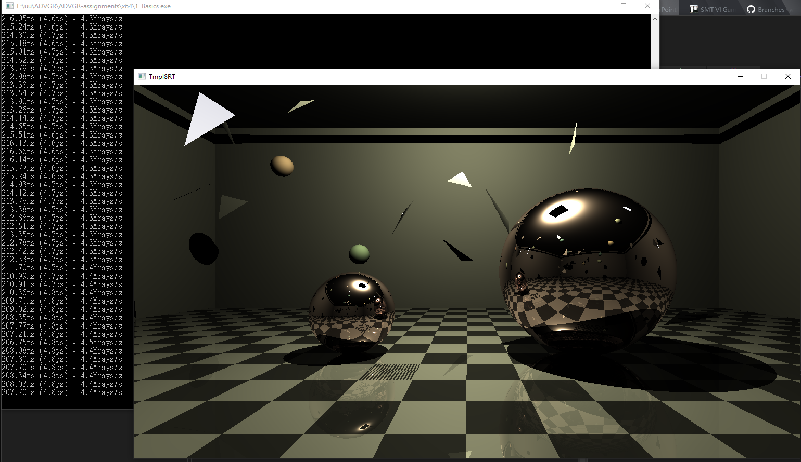
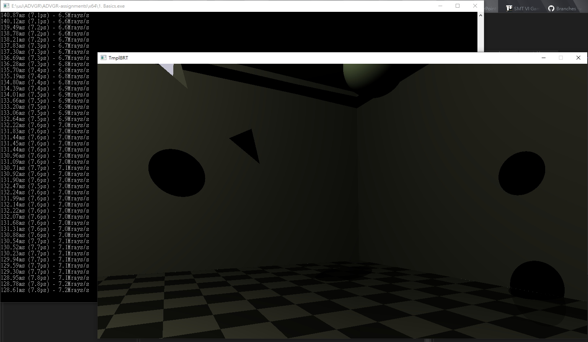
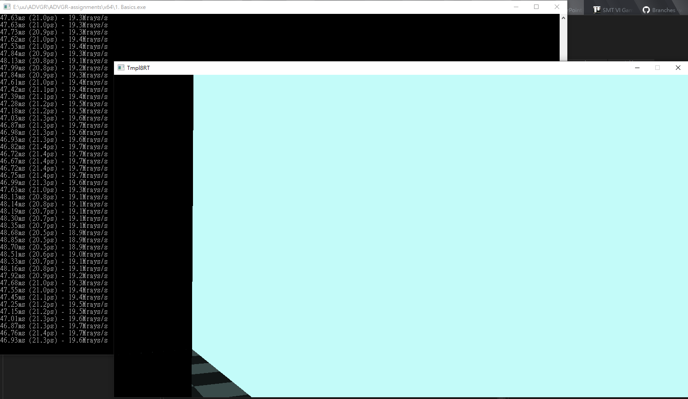
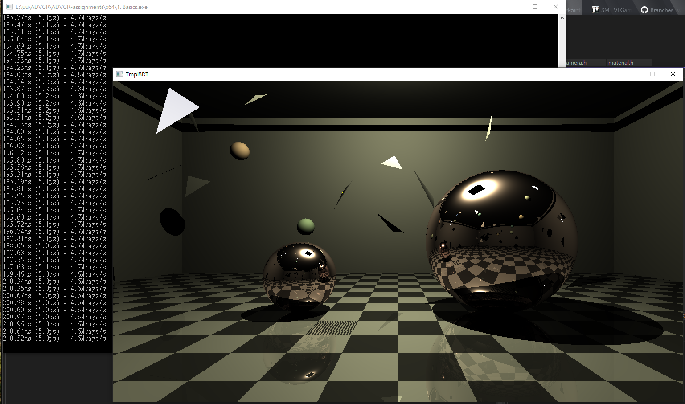
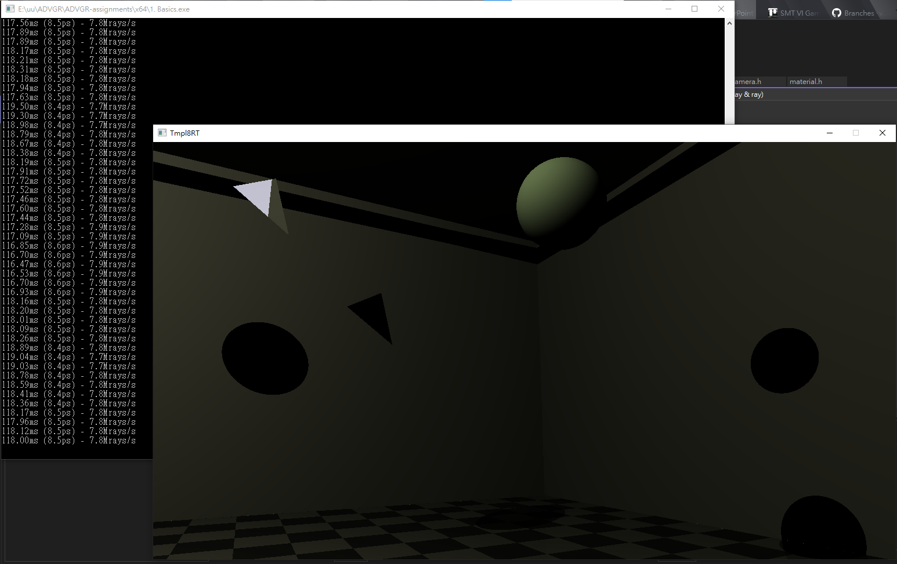
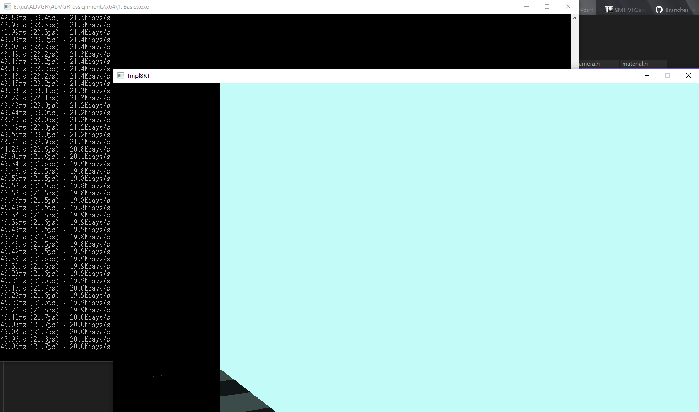

# ADVGR2022 Assignment

This is a assignment project for ADVGR2022 in Utrecht University. The project is built from the template made by the lecturer [Jacco Bikker](https://github.com/jbikker). Further information for the template is in [Reference](#Reference) section.

## Switch Between Whitted Style & Path Tracer:

```
In renderer.h

RendererModuleType rendererModuleType = RendererModuleType::PathTrace;

or

RendererModuleType rendererModuleType = RendererModuleType::WhittedStyle;
```

## Control

W、A、S、D for moving

Holde Right Mouse for aiming

`camera.h` for configuring fov, moving speed

## Assignment 2 Report

### Scene
In the presented scene, there are 1 light source, 2 specular sphere, 5 quad walls, 1 half-specular quad ground, 20 triangles in arbitrary position & location, and 10 diffuse sphere in arbitrary position. The renderer is whitted style ray tracer.

### Without BVH
Without BVH, frame rate stands at 1.1 ~ 1.5 fps. When the camera looks at a corner, the frame rate remains the same. When the camera moves outside the room, there is a small increase of frame rate.





### With BVH
Without BVH, frame rate increase to 4.6 ~ 4.8 fps. When the camera looks at a corner, the frame rate grows to 7.1 ~ 7.9 fps, which is almost doubled. Next, I moved the camera to outside the room, the frame rate grows sharply to 20 ~ 21 fps. Which is definitely benefit from BVH.





### Distinguish ‘occlusion’ rays and ‘nearest hit’ rays
After implemented this feature, the frame rate slightly increases to 5.0 ~ 5.2 fps. When the camera looks at a corner 8.4 ~ 8.6 fps. Unsurprisingly, the frame rate also sharply increases to 21 ~ 23 fps, a slight greater than the BVH one.





## Progress

Add BVH traversal to the ray tracing template you created for assignment 1. Make sure it works with the existing
code base and functionality. Concretely:

- [x] Make the BVH accelerate your Whitted-style ray tracer and Kajiya path tracer;
- [x] Make sure the BVH handles spheres, triangles and planes, as well as diffuse and specular materials.

Note that handling spheres is not discussed in the 10 articles. It should however not be very hard to add.

For 50% of the points (5), you need to implement one additional feature that is not discussed in the articles:

- [x] Distinguish ‘occlusion’ rays and ‘nearest hit’ rays. Make sure this is not just an interface matter; a correct implementation exploits the difference during traversal.

## Beyond a Five

To get more out of the BVH and score beyond a 5, you may take on one of the following challenges.

- [ ] Upgrade the BVH to a QBVH, where each node has not two but four children. A successful implementation is provably faster than the original BVH and scores up to 2 extra points.
- [ ] Traverse the BVH with more than a single ray at a time. A successful implementation is substantially faster for certain classes of rays and scores up to 2 extra points.
- [ ] It can be beneficial to relax the ‘object partition’ nature of a BVH for some polygons, cutting them in half for the greater good. Various ways to do this exist. A successful implementation yields a substantial improvement in traversal performance and yields up to 4 extra points.
- [ ] A generated tree may benefit from various ‘postprocessing’ operations. Improving the tree this way and proving that the method is effective may yield up to 2 extra points.
- [ ] Experimenting with other heuristics than the standard ‘SAH’ may yield op to 1 extra point.
- [ ] An insightful analysis of the behavior of (the performance of) your implementation may yield up to 1 extra point. Data to look for may include node count, summed node area, traversal steps, intersected primitive count and tree depth.
- [ ] Build the BVH on the GPU for 4 points

## Reference

This template is intended for students of Utrecht University.

**Please refer to "\_ getting started.pdf" for instructions.**

Code is fully public domain. Use as you please.

Contact me at bikker.j@gmail.com.
